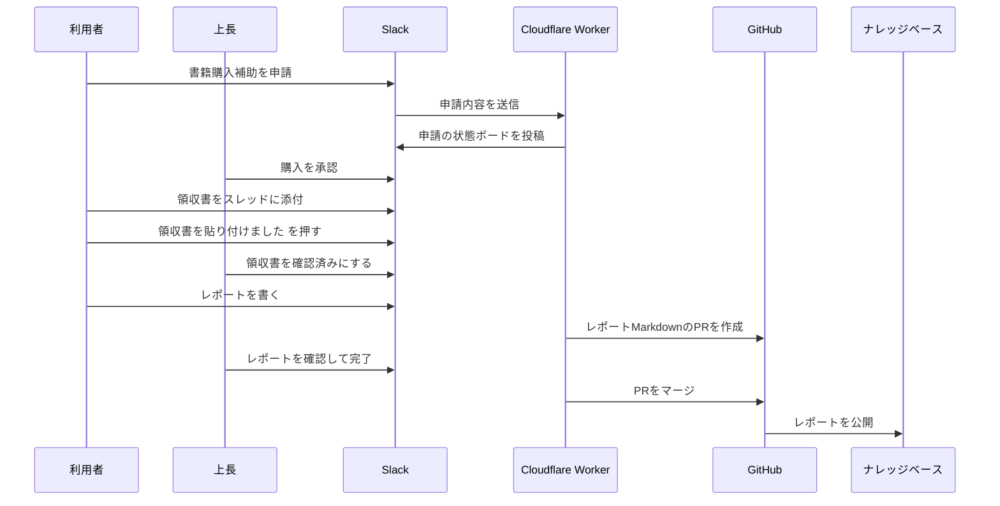

# Saiteki Engineering Training Documentation

新人エンジニア向け研修資料と、書籍購入補助のナレッジベースを管理するリポジトリです。
VitePressを使用して構築されており、GitHub Pagesで公開されています。

## 公開URL

[https://Saitekiinc-com.github.io/saiteki-study-doc/](https://Saitekiinc-com.github.io/saiteki-study-doc/)

書籍購入補助の案内は次のページから確認できます。

[https://saitekiinc-com.github.io/saiteki-study-doc/knowledge_base/](https://saitekiinc-com.github.io/saiteki-study-doc/knowledge_base/)

## 書籍購入補助フロー

書籍購入補助の利用者向け操作はSlackで完結します。
GitHubは、読了後の書籍レポートをナレッジベースとして保存するために使います。



## 主な構成

- `docs/`: VitePressのドキュメント
  - `docs/knowledge_base/`: 書籍購入補助の案内と書籍レポート
  - `docs/training/`: 研修資料
- `workers/slack-book-gateway/`: Slack申請を受け付けるCloudflare Worker
- `tests/workers/`: Slack Gateway向けのテスト
- `.github/workflows/`: GitHub Pages公開やナレッジ更新用のワークフロー
- `.github/ISSUE_TEMPLATE/`: 旧GitHub Issue導線で使っていたテンプレート

## ローカルでの開発

### セットアップ

```bash
npm install
```

### ドキュメントの開発サーバー

```bash
npm run docs:dev
```

表示されたローカルURLにアクセスしてプレビューします。

### ドキュメントのビルド

```bash
npm run docs:build
```

## Slack Gateway

Slack GatewayはCloudflare Workersで動かします。

```bash
npm run slack:worker:dev
npm run slack:worker:deploy
```

詳しい設定は [workers/slack-book-gateway/README.md](./workers/slack-book-gateway/README.md) を確認してください。

## 更新・デプロイ方法

このリポジトリの `main` ブランチにプッシュすると、GitHub Actionsが自動的にビルドを行い、公開サイトを更新します。

```bash
git add .
git commit -m "docs: update book purchase guide"
git push origin main
```

数分後、GitHub Pagesに反映されます。