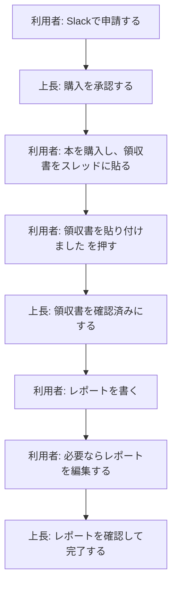

# 書籍購入補助の流れ

書籍購入補助は、Slack上の申請投稿を中心に進めます。
利用者も上長も、基本的な操作はSlack上のボタン、スレッド、フォームで完結します。

## 全体像

レポート送信後は `レポート確認待ち` になります。
この状態では、利用者が `レポートを編集` から内容を修正できます。
編集すると、Slack上のレポート内容とGitHubに保存されるレポートデータが更新されます。

## 関連ページ

- [利用者向け操作ガイド](./slack_purchase_flow)
- [上長向け操作ガイド](./slack_purchase_manager)
- [よくある質問](./slack_purchase_faq)
