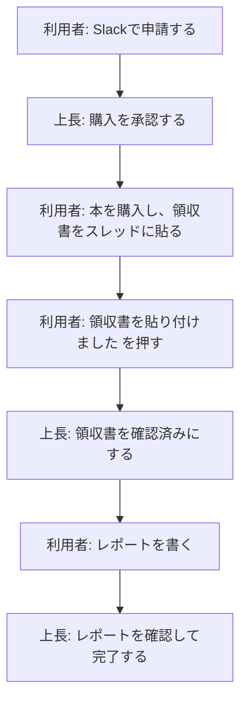

# 書籍購入補助の流れ

書籍購入補助は、Slack上の申請投稿を中心に進めます。
詳しい操作手順は [Slackで書籍購入補助を申請する](./slack_purchase_flow) にまとめています。

## 全体像

## 利用者がやること

| タイミング | やること |
|---|---|
| 申請時 | Slackの申請フォームに、氏名、書名、書籍URL、対象月、購入目的を入力する |
| 購入後 | 申請投稿のスレッドに領収書画像を貼り、`領収書を貼り付けました` を押す |
| 読了後 | 申請投稿の `レポートを書く` からレポートを提出する |

## 上長がやること

| タイミング | やること |
|---|---|
| 申請後 | 書名、URL、購入目的を確認し、`購入を承認` を押す |
| 領収書提出後 | スレッド内の領収書画像を確認し、`領収書を確認済みにする` を押す |
| レポート提出後 | スレッド内のレポート内容を確認し、`レポートを確認して完了` を押す |

## 間違えた場合

申請投稿に `一つ前に戻す` が表示されている場合は、直前の操作を取り消せます。

ただし、完了後はSlackから一つ前に戻せません。
必要な場合は上長または管理者に相談してください。

## 関連ページ

- [Slackで書籍購入補助を申請する](./slack_purchase_flow)
