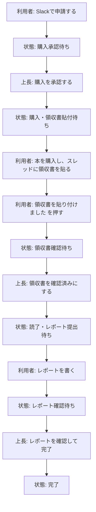

# 書籍購入補助の流れ

書籍購入補助は、Slack上の申請投稿を中心に進めます。
利用者はSlackだけで申請、領収書提出、レポート提出まで行います。

## このページで分かること

- 利用者がSlackで何をすればよいか
- 上長がどのボタンで承認・確認するか
- 領収書をどこに貼るか
- 読了後の書籍レポートをどこから提出するか
- 完了後に何が起きるか

## 全体像

## 利用者が行う手順

| ステップ | やること | 補足 |
|---:|---|---|
| 1 | Slackの `書籍購入補助を申請する` を押す | 見つからない場合は `/book` でも開けます。 |
| 2 | 申請フォームに入力する | 氏名、書名、書籍URL、対象月、購入目的を入力します。 |
| 3 | 上長の購入承認を待つ | 状態は `購入承認待ち` になります。 |
| 4 | 承認後に本を購入する | 状態が `購入・領収書貼付待ち` になってから購入します。 |
| 5 | 申請投稿のスレッドに領収書を貼る | 領収書は画像で問題ありません。 |
| 6 | `領収書を貼り付けました` を押す | 領収書を貼っただけでは状態は進みません。 |
| 7 | 上長の領収書確認を待つ | 状態は `領収書確認待ち` になります。 |
| 8 | 読了後に `レポートを書く` を押す | Slackのフォームからレポートを提出します。 |
| 9 | 上長のレポート確認を待つ | 状態は `レポート確認待ち` になります。 |
| 10 | 完了を確認する | 完了した申請にはチェックのリアクションが付きます。 |

## 上長が行う手順

| 状態 | 確認すること | 押すボタン |
|---|---|---|
| 購入承認待ち | 書名、URL、購入目的 | `購入を承認` |
| 領収書確認待ち | スレッド内の領収書画像 | `領収書を確認済みにする` |
| レポート確認待ち | スレッド内のレポート内容 | `レポートを確認して完了` |

上長のボタン操作は、操作した人のメンション付きでスレッドに記録されます。

## 領収書の貼り方

領収書は、自分の申請投稿のスレッドに貼ります。

領収書から次の内容が分かる状態にしてください。

- 購入日
- 購入金額
- 購入先
- 購入した書籍が分かる情報

領収書を貼ったあと、必ず `領収書を貼り付けました` を押してください。

## 書籍レポート

購入補助を受けた本は、読了後に書籍レポートを提出します。

上長が領収書を確認すると、申請投稿に `レポートを書く` が表示されます。
そのボタンからSlackフォームを開き、レポートを入力してください。

レポート提出後、上長が内容を確認して完了にします。
完了後、レポートはナレッジベースに保存されます。

## 間違えた場合

申請投稿に `一つ前に戻す` が表示されている場合は、直前の操作を取り消せます。

ただし、完了後はSlackから一つ前に戻せません。
必要な場合は上長または管理者に相談してください。

## 関連ページ

- [Slackで書籍購入補助を申請する](./slack_purchase_flow)
- [書籍レポートを提出する](./issue_book_report)
- [Issueを閉じたい場合](./issue_close)