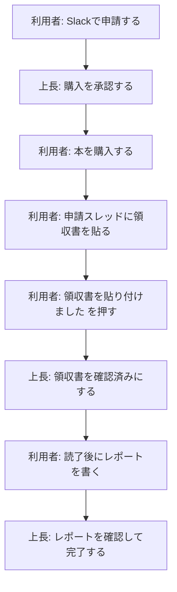

# Slackで書籍購入補助を申請する

> 工事中
>
> このページは、Slackで書籍購入補助を申請するための操作ガイドです。制度の詳しい条件ではなく、Slack上で何をすればよいかだけをまとめています。

## まずやること

書籍購入補助のチャンネルを開きます。

チャンネル上部またはピン留めされた投稿にある `書籍購入補助を申請する` ボタンから申請します。

ボタンが見つからない場合は、チャンネル内で `/book` と入力して申請フォームを開くこともできます。

## 全体の流れ

## 利用者の操作

### 1. 申請する

`書籍購入補助を申請する` を押して、フォームに入力します。

入力するもの:

- 氏名
- 書名
- 書籍URL
- 対象月
- 購入目的

送信すると、チャンネルに申請用の投稿が作成されます。この投稿が、その申請の状態ボードになります。

### 2. 承認を待つ

申請直後の状態は `購入承認待ち` です。

上長が `購入を承認` を押すと、状態が `購入・領収書貼付待ち` に変わります。

### 3. 領収書を貼る

購入後、申請投稿のスレッドに領収書画像を貼り付けます。

貼り付けたあと、申請投稿の `領収書を貼り付けました` を押します。

これで状態が `領収書確認待ち` に変わります。

### 4. 読了後にレポートを書く

上長が領収書を確認すると、状態が `読了・レポート提出待ち` に変わります。

本を読み終わったら、申請投稿の `レポートを書く` を押して、フォームに入力します。

入力するもの:

- 書籍名
- 著者
- リンク
- 読む前の目的
- 得られた知識
- 実務における活用
- 良かった点
- 難しかった点・合わなかった点
- どんな人におすすめか

送信すると、レポート本文がスレッドに投稿されます。

### 5. 完了を待つ

レポート送信後の状態は `レポート確認待ち` です。

上長が内容を確認して `レポートを確認して完了` を押すと、状態が `完了` になります。

完了した投稿には、見分けやすいようにチェックのリアクションが付きます。

## 上長の操作

上長は、申請投稿のボタンで進めます。

| 状態 | 押すボタン |
|---|---|
| 購入承認待ち | `購入を承認` |
| 領収書確認待ち | `領収書を確認済みにする` |
| レポート確認待ち | `レポートを確認して完了` |

ボタン操作の履歴は、誰が押したか分かるようにスレッドへ残ります。

## 間違えた場合

申請投稿に `一つ前に戻す` が出ている場合は、直前の操作を取り消せます。

たとえば、領収書確認を間違えて押した場合は、`一つ前に戻す` で前の状態に戻せます。

ただし、`完了` になった後はSlackから戻せません。

## よくある質問

### 申請ボタンが見つかりません

チャンネル上部のピン留め投稿を確認してください。

見つからない場合は、チャンネル内で `/book` と入力すると申請フォームを開けます。

### 領収書はどこに貼ればいいですか？

自分の申請投稿のスレッドに貼ります。

チャンネルに新しく投稿するのではなく、申請投稿の返信として貼ってください。

### 領収書を貼っただけで完了ですか？

完了ではありません。

領収書を貼ったあとに、申請投稿の `領収書を貼り付けました` を押してください。

### レポートはどこから書きますか？

申請投稿の `レポートを書く` から入力します。

GitHubを開いてIssueを作る必要はありません。

### GitHubは触りますか？

利用者は基本的に触りません。

レポートは裏側でGitHubに保存されますが、操作はSlack上のボタンとフォームで完結します。

### 間違えて申請しました

まずは申請投稿のスレッドで、間違えたことをコメントしてください。

状態を戻せる場合は、`一つ前に戻す` を使います。

