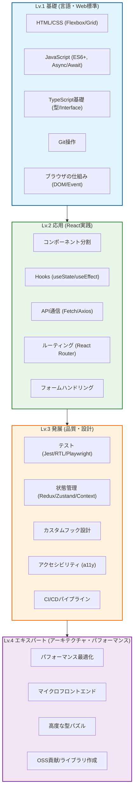

# React/TypeScript スキルピラミッド

このドキュメントでは、React/TypeScriptエンジニアとして成長するためのロードマップを、ピラミッド型の階層構造で示します。
下層のスキルが上層のスキルの土台となります。

## スキルピラミッド図

## レベル別詳細解説

### Lv.1 基礎 (Foundation)
**目標**: Webの仕組みを理解し、静的なページや簡単なスクリプトが書ける。
*   **HTML/CSS**: セマンティックなマークアップ、レスポンシブデザイン。
*   **JavaScript**: ES6+の構文、非同期処理の理解。
*   **TypeScript**: 基本的な型定義、コンパイルエラーの解消。

### Lv.2 応用 (Application)
**目標**: Reactを使って、機能するアプリケーションを構築できる。
*   **React Hooks**: `useState`, `useEffect` などの基本的なフックの理解と活用。
*   **コンポーネント設計**: 再利用可能な単位でのコンポーネント分割。
*   **API通信**: バックエンドとのデータ連携。

### Lv.3 発展 (Advanced)
**目標**: 保守性が高く、品質の高いコードが書ける。
*   **テスト**: 単体テスト、統合テスト、E2Eテストの実装。
*   **状態管理**: 複雑なアプリケーションの状態を適切に管理する。
*   **パフォーマンス**: 不要なレンダリングの抑制 (`useMemo`, `useCallback`)。

### Lv.4 エキスパート (Expert)
**目標**: 技術的な意思決定を行い、チーム全体の生産性を向上させる。
*   **アーキテクチャ**: プロジェクト規模に応じた適切なアーキテクチャ選定。
*   **ツールチェーン**: ビルドツールの設定、開発体験(DX)の向上。
*   **メンタリング**: 他のメンバーへの技術指導。
