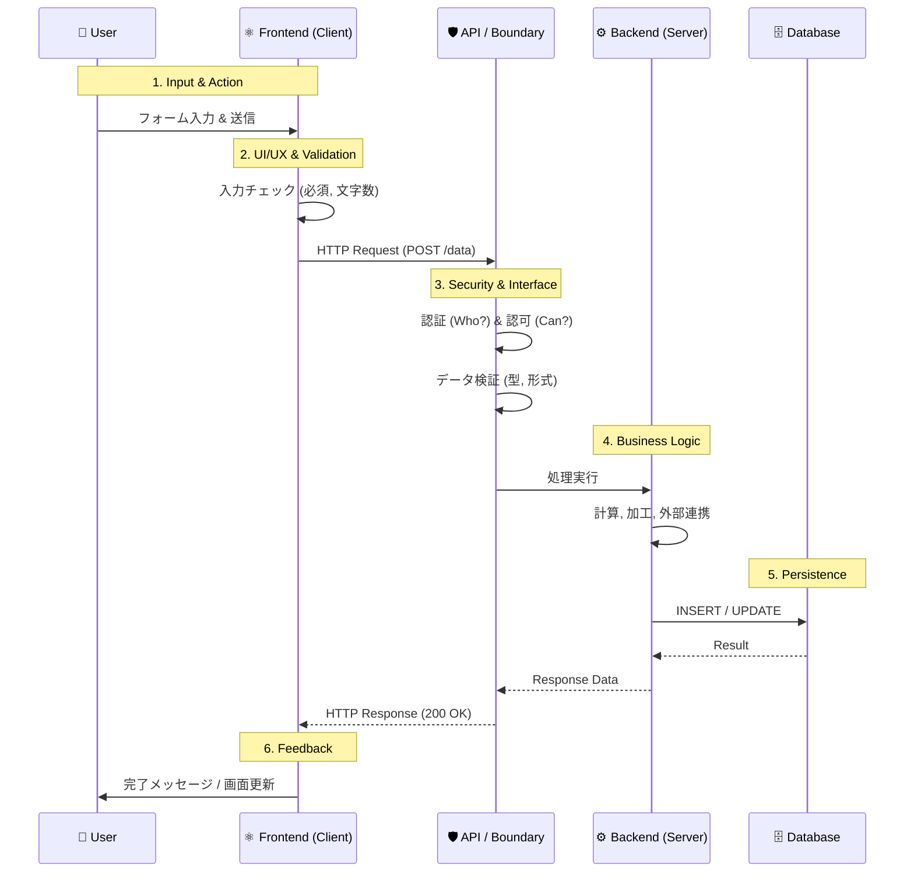

# データの流れとシステム設計 (Data Flow & System Design)

アプリケーション開発において、フロントエンドとバックエンドは別々の存在ではありません。
**「ユーザーの入力したデータを、安全にデータベースに保存し、必要な時に取り出して表示する」** という一つの目的のために連携するチームです。

このドキュメントでは、アプリケーション全体を「データの流れ」として捉え、各フェーズで意識すべき観点を解説します。

## 1. 全体像: データの旅

ユーザーが「保存ボタン」を押してから、データがデータベースに格納され、再び画面に表示されるまでの旅を見てみましょう。

## 2. 各フェーズの役割と観点

### ① Frontend: 最高のユーザー体験 (UX) を作る
データの入り口であり、出口です。ユーザーがストレスなくデータを入力・閲覧できるようにすることが使命です。

*   **即座のフィードバック**:
    *   サーバーに送る前に、明らかな間違い（必須漏れ、メール形式など）を検知し、その場でユーザーに教える。
*   **操作性 (Usability)**:
    *   入力しやすいフォーム、分かりやすいエラーメッセージ。
    *   ローディング表示（処理中であることを伝える）。

### ② API / Boundary: 鉄壁の守り (Security)
インターネットという「公道」と、システム内部の「私有地」の境界線です。ここで不正な侵入を防ぎます。

*   **認証 (Authentication)**:
    *   「あなたは誰ですか？」 (ログイン状態の確認)。
*   **認可 (Authorization)**:
    *   「あなたにその権限はありますか？」 (他人のデータを書き換えようとしていないか)。
*   **バリデーション (Validation)**:
    *   フロントエンドのチェックは「親切」のためですが、APIのチェックは「安全」のためです。**フロントエンドからのデータは決して信用してはいけません。**

### ③ Backend: ビジネスロジックの要 (Logic)
データの加工や、複雑なルールの適用を行います。

*   **整合性 (Consistency)**:
    *   「在庫を減らす」と「注文履歴を作る」をセットで行う（トランザクション）。
*   **計算と加工**:
    *   合計金額の計算、メールの送信、外部決済システムとの連携。

### ④ Database: 資産の保管庫 (Persistence)
システムの中で最も重要な「データ資産」を永続的に守ります。

*   **正規化 (Normalization)**:
    *   データの重複をなくし、矛盾が起きないように設計する。
*   **スケーラビリティ (Scalability)**:
    *   データ量が100万件、1000万件になっても検索できるように、インデックスを貼る。
    *   将来の機能拡張（カラム追加など）に耐えられる設計にする。

## まとめ
フロントエンドエンジニアも「このデータはDBにどう保存されるか？」を想像し、
バックエンドエンジニアも「ユーザーはこのデータをどう使うか？」を想像する。

お互いの領域を理解し、**「データのバケツリレー」** をスムーズにすることが、良いアプリケーションを作る鍵です。
